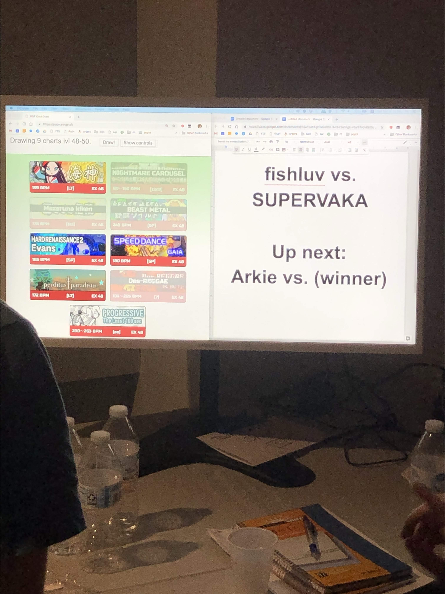

# About this fork

The base project is an app for drawing random songs for _Dance Dance Revolution_ (DDR) tournament matches. Here's what it looked like (at time of forking):


In this fork, I've adapted the app for a different game: _pop'n music_. I've also included a number of UI enhancements, such as displaying the banner images for songs, and including translations for songs whose titles are in Japanese. Some of these improvements were ported to the main app!


The app is deployed online at: https://popn.surge.sh .

The fork was developed for the _Raj of the Garage_ tournament in Columbus, OH in December of 2018. Here's a photo of the app in use at the tournament:



The original README from the base project is below.

# DDR Card Draw

App by Jeff Lloyd, ported to react by me for ease of development.

Pre-built, standalone ZIP files are available for download on the [releases page](https://github.com/noahm/DDRCardDraw/releases)

## Developing

```
npm install

# local development
npm start

# double check changes to song list in ./src/songs/ace.json
npm run validate

# output static site to ./dist
npm run build
```
